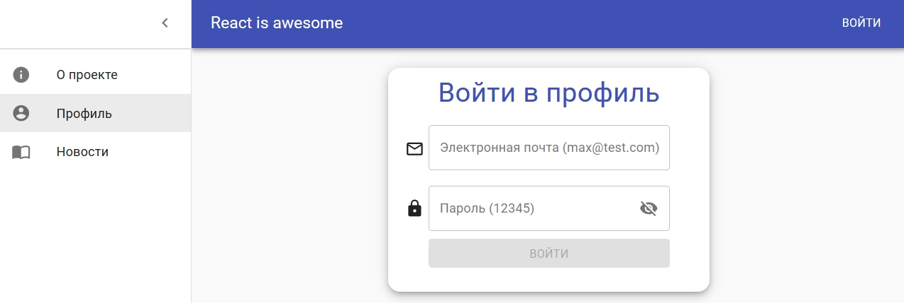
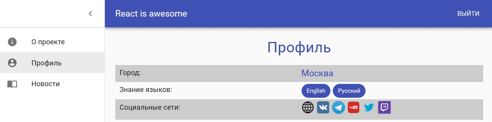
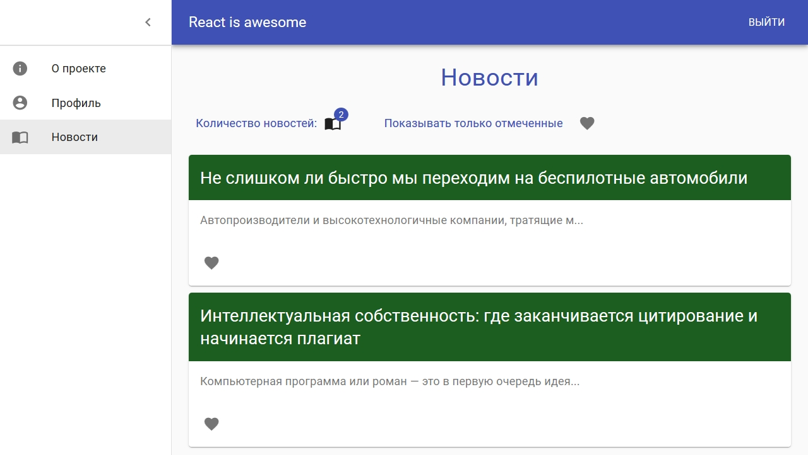
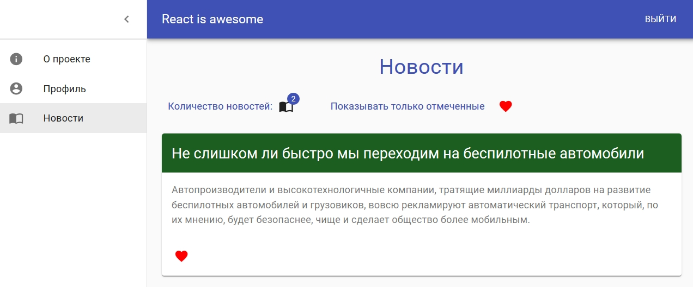

# Max-Patzinsky-second-test
Ссылка: https://alexaltrex.github.io/Second-test

## Описание
Второе тестовое задание Максима Пацианского (https://github.com/maxfarseer/tz-webinars/tree/tz-2-react-redux-router-async). Прототип социальной сети: логинизация, загрузка и вывод массива новостей с сервера. 

## Запуск проекта:
Для установки и запуска необходимы установленные программы: Node.js, npm, Git;
1. Клонирование и запуск: git clone https://github.com/Alexaltrex/Max-Patzinsky-second-test.git;
2. Переход в директорию с проектом: cd Max-Patzinsky-second-test;
3. Установка зависимостей: npm install;
4. Запуск проекта в режиме разработки: npm start;
5. Перейти в браузер и открыть страницу: http://localhost:3000.

## Цель проекта
* Изучение основ React, Redux, логинизация, обработка данных с сервера;
* Изучение основных паттернов типизации React-приложения;
* Изучение библиотеки Material-UI;

## Разработка
* Приложение разработано на базе библиотеки React v.16.13.1 с использованием Create React App (https://github.com/facebook/create-react-app)
* Приложение разработано на базе API: 'https://mysterious-reef-29460.herokuapp.com/api/v1'
* Глобальное состояние: управление - Redux v.4.0.5, доступ - доступ - react-redux (connect)
* Деление компонетны на "глупые" функциональные и контейнерные (обертки для доступа к store или классовые для побочных эффектов)
* Локальное состояние: хук "useState"
* Побочные эффекты: хук "useEffect"
* Роутинг: React-router-dom v.5.2.0
* Асинхронный код: Redux-thunk v.2.3.0
* Сетевые запросы: Axios v.0.19.2
* Работа с формами: Redux-form v.8.3.6
* Дизайн: Material-UI v.4.11.0
* Типизация - Typescript v.3.7.2

## Структура приложения
1. Заголовок: логотип и кнопка авторизации;
2. Выдвижное боковое меню с ссылками на страницы: "О проекте", "Профиль", "Новости";
3. Основная часть контента.

### Форма авторизации
Электронная почта и пароль (есть функция показа текста пароля). Авторизация нужна для перехода на страницу "Профиль".

### Страница "О проекте"
Основные сведения о разработке

### Страница "Профиль"
Данные о профиле зарегестрированного пользователя: город проживания, знание языков, ссылки на социальные сети.

### Страница "Новости"
* Заголовок
* Блок управления и информации: количество новостей и фильтрация отмеченных новостей.
* Список новостей: заголовок, краткий текст, нижнее контекстное меню с возможностью отметить новость. При клике на текте показывается полная его версия.

